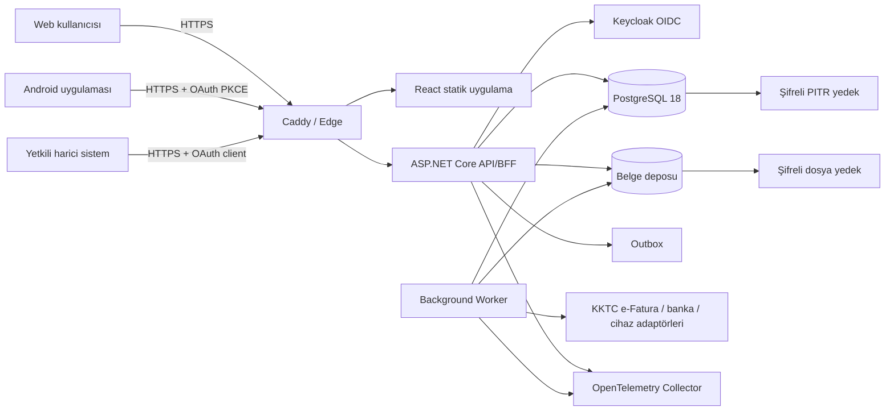

# 00 — Teknik Temel ve Sistem Altyapısı

- **Durum:** Accepted baseline
- **Sürüm:** 1.0
- **Son inceleme:** 19 Ağustos 2026
- **Amaç:** Tüm uygulama, repository, server, veri, entegrasyon ve istemci kararlarının ortak teknik tabanını tanımlamak.

## 1. Mimari hedef

Sistem; orta ölçekli, ticaret/hizmet ve temel stok operasyonu bulunan bir şirket grubunun finans, cari, stok, banka/kasa, çek/senet, satış, satın alma, muhasebe ve KKTC uyum süreçlerini tek doğrulanabilir olay zincirinde yönetir.

Temel kalite önceliği sırası:

1. Finansal doğruluk ve veri bütünlüğü.
2. Yetki, tenant/şirket izolasyonu ve denetlenebilirlik.
3. KKTC mevzuatına uyarlanabilirlik.
4. Geri yüklenebilirlik ve operasyonel süreklilik.
5. Kullanılabilirlik ve performans.
6. Genişleme ve ürünleştirme kolaylığı.

## 2. Tasarım zarfı

| Boyut | Başlangıç hedefi | Tasarım üst zarfı |
|---|---:|---:|
| Adlandırılmış kullanıcı | 20–150 | 500 |
| Eşzamanlı aktif kullanıcı | 10–50 | 150 |
| Şirket | 1–20 | 100 |
| Şube/depo | 1–50 | 500 |
| İşlem satırı | 5 milyon | 50 milyon; bölümleme/archival kararıyla |
| İstemci | Web + Android | Harici API istemcileri |
| Para birimi | TRY, GBP, EUR, USD başta | ISO 4217 kataloğu |
| Dil | Türkçe | İngilizce eklenebilir i18n altyapısı |

Bu değerler kapasite garantisi değildir; [performans planındaki](../quality/03-performance-and-capacity.md) yük testleriyle doğrulanır.

## 3. Kabul edilmiş yüksek seviye kararlar

| ID | Karar | Gerekçe |
|---|---|---|
| ARCH-001 | Modüler monolit | Tek transaction içinde stok/cari/GL bütünlüğü; küçük ekip ve orta ölçek için düşük operasyon yükü |
| ARCH-002 | .NET 10 LTS | LTS, güçlü tip/decimal/transaction desteği; Kasım 2028'e kadar resmi destek |
| ARCH-003 | PostgreSQL 18 | ACID, `numeric`, RLS, güçlü indeksleme; Kasım 2030'a kadar destek |
| ARCH-004 | React + Vite + shadcn/ui | Hızlı, sade ve sahip olunan component kodu; veri yoğun ERP ekranlarına uygun |
| ARCH-005 | Kotlin + Compose | Android için resmi modern UI ve katmanlı/offline-first mimari |
| ARCH-006 | Keycloak OIDC | Self-hosted OAuth/OIDC, MFA, realm/client ve yönetim yetenekleri |
| ARCH-007 | Caddy edge proxy | Basit ters proxy ve otomatik TLS; yalnız 80/443 dışa açık |
| ARCH-008 | Docker Compose / tek host | İlk üretimde yönetilebilirlik; ihtiyaç kanıtlanınca HA topolojisine geçiş |
| ARCH-009 | API-only istemciler | Web/mobilde doğrudan DB erişimini, kural ve yetki atlamayı engelleme |
| ARCH-010 | DB outbox + worker | Dış entegrasyonda güvenilir yeniden deneme; ilk fazda broker zorunluluğu yok |
| ARCH-011 | Local encrypted blob + adapter | Tek sunucuda sade başlangıç; onay sonrası S3 uyumlu konuma taşınabilir |

Versiyonlar imaj ve lock dosyalarında tam pinlenir; burada belirtilen ana sürüm içinde güvenlik yamaları düzenli uygulanır.

## 4. Sistem bağlamı



### Güven sınırları

- İnternet sınırı: Yalnız Caddy 80/443 alır. SSH yalnız yönetim IP/VPN üzerinden.
- Uygulama sınırı: API ve worker özel Docker ağında; host portu yayınlamaz.
- Veri sınırı: PostgreSQL ve belge deposu özel ağ/volume; internetten erişilmez.
- Kimlik sınırı: Keycloak public login endpoint'i edge üzerinden; admin yüzeyi ayrı hostname ve VPN/IP allowlist.
- Yedek sınırı: Production hesabından farklı kimlik bilgisi ve tercihen farklı fiziksel/uzak hedef.

## 5. Uygulama bileşenleri

| Bileşen | Sorumluluk | Ölçekleme |
|---|---|---|
| `erp-web` | Statik React bundle | Caddy cache; stateless |
| `erp-api` | BFF, REST API, domain/application işlemleri | Dikey; sonra birden fazla instance |
| `erp-worker` | Outbox, rapor, e-Fatura, import/export, bildirim | Kuyruk türüne göre worker sayısı |
| `keycloak` | Kimlik, MFA, OIDC client/realm | İlk hostta tek; HA aşamasında ayrı DB/cache |
| `postgres` | İşlem, audit metadata, idempotency, job/outbox | En kritik stateful servis |
| `blob-store` | XML/PDF/ek dosyaları | İlk faz yerel şifreli volume; adapter ile S3 |
| `caddy` | TLS, reverse proxy, güvenlik başlıkları | Edge; konfigürasyon kontrollü |
| `otel-collector` | Telemetry alma ve yönlendirme | Monitoring profile |
| `prometheus/grafana/loki/tempo` | Metric, dashboard, log, trace | Ayrı volume; üretim verisi içermez |

Redis, Kafka/RabbitMQ, Elasticsearch ve Kubernetes başlangıç bağımlılığı değildir. Eklenmeleri için ölçülmüş darboğaz, veri sahibi ve kabul edilmiş ADR gerekir.

## 6. Backend yapısı

Backend clean/layered fakat pragmatik bir modüler monolit olarak düzenlenir:

- `Domain`: Entity/value object, state transition, invariant; altyapı bağımlılığı yok.
- `Application`: Use case/command/query, transaction sınırı, permission ihtiyacı, DTO mapping.
- `Infrastructure`: EF Core, PostgreSQL, blob, e-posta, adapter, clock, id generator.
- `Api`: HTTP contract, auth, validation, Problem Details, rate limit.
- `Worker`: Outbox ve uzun/asenkron işler.

Her modül kendi `Domain/Application/Infrastructure/Contracts` alanına sahiptir. Modül dışı kullanım `Contracts` üzerinden olur. Başka modülün `DbSet` veya internal sınıfı referanslanmaz.

## 7. Veri ve transaction modeli

- Tek PostgreSQL cluster/instance; iş verisi ve Keycloak için ayrı database/rol.
- ERP içinde modül başına schema: `iam`, `org`, `party`, `inventory`, `sales`, `purchasing`, `treasury`, `instruments`, `accounting`, `compliance`, `workflow`, `platform`, `reporting`.
- Tek ticari kesinleştirme; kaynak belge, stok/cari hareket ve GL kaydını aynı DB transaction'ında üretir.
- Dış çağrı transaction içinde yapılmaz. Aynı transaction'da `platform.outbox_message` yazılır; worker daha sonra gönderir.
- Varsayılan isolation `READ COMMITTED`. Belge numarası, stok rezervasyonu ve settlement gibi yarış noktalarında row/advisory lock; yalnız kanıtlı ihtiyaçta `SERIALIZABLE`.
- Kimlikler UUIDv7; harici iş anahtarı ayrıca unique constraint ile tutulur.
- Tüm iş tablolarında `created_at`, `created_by`, `version`; değişebilir tablolarda `updated_at`, `updated_by`.
- Soft delete her yerde varsayılan değildir. Master veride `is_active`; finansal harekette silme yok.

## 8. Çok şirket ve tenant izolasyonu

- İlk kullanım tek müşteri grubu olsa da `tenant_id` ilk günden vardır.
- `company_id` şirket gerçekliğine sahip her satırda zorunludur.
- Uygulama, her requestte token/session kapsamını `ExecutionContext` içine çözer.
- Transaction başında `SET LOCAL app.tenant_id`, `app.company_ids`, `app.user_id` uygulanır.
- Korunan tablolarda RLS `ENABLE` + `FORCE`; uygulama rolü owner/superuser/BYPASSRLS değildir.
- Background job da açık tenant/company context ile çalışır; `system` kapsamı sınırsız erişim anlamına gelmez.
- Backup rolü RLS nedeniyle eksik veri almayacak özel, denetlenmiş role sahiptir.

## 9. Kimlik doğrulama ve oturum

### Web

- Aynı origin BFF/cookie modeli.
- OIDC Authorization Code flow; token JavaScript'e verilmez.
- Cookie `Secure`, `HttpOnly`, uygun `SameSite`; state-changing isteklerde anti-CSRF.
- Yüksek riskli işlemde step-up MFA veya yakın tarihli doğrulama.

### Android

- System browser üzerinden OIDC Authorization Code + PKCE.
- Access token kısa ömürlü; refresh rotation; güvenli Keystore-backed saklama.
- WebView içinde parola girişi yok.
- Cihaz kaydı, token iptali, biyometrik uygulama kilidi ve ekran görüntüsü politikası risk bazlı.

### Servis entegrasyonu

- Client credentials yalnız güvenilen machine-to-machine entegrasyonda.
- Her entegrasyon için ayrı client, en dar scope, secret rotation ve audit.

## 10. API sözleşmesi

- REST/JSON, `/api/v1`, OpenAPI 3.1.
- Para tutarı JSON'da string decimal + ISO currency.
- Tüm yazma endpointlerinde `Idempotency-Key`; güncellemede `If-Match`/version.
- RFC 9457 Problem Details; stabil `code`, `traceId`, alan hataları.
- Cursor pagination; filtre ve sort allowlist.
- Büyük export/import asenkron job; polling ve güvenli süreli indirme.
- API istemci kodu OpenAPI'den üretilir; el yazımı endpoint stringleri yasaktır.

## 11. Dosya ve yasal arşiv

- Dosya bytes'ı DB'de tutulmaz; metadata `platform.attachment`, içerik blob katmanında.
- Yol kullanıcı girişinden türetilmez; opaque ID ile yazılır.
- SHA-256, MIME, byte size, original filename, owner tenant/company, uploader, retention class ve legal hold saklanır.
- Upload quarantine → doğrulama/tarama → accepted/rejected durumu.
- e-Fatura kesin XML'i, Daire yanıtı, doğrulama raporu ve görüntü kopyası ayrı legal archive sınıfıdır.
- Yerel volume LUKS/host encryption ile korunur. Uzak S3/WORM yalnız veri konumu ve KKTC transfer/onay kararıyla.

## 12. Linux production topolojisi

### Önerilen işletim sistemi

- Yeni kurulum: Ubuntu Server 26.04 LTS minimal.
- Uyum gerekirse: Ubuntu Server 24.04 LTS.
- Masaüstü paketleri kurulmaz; otomatik güvenlik güncellemesi kontrollü bakım penceresiyle.

### Başlangıç donanımı

| Seviye | CPU | RAM | Disk | Kullanım |
|---|---:|---:|---:|---|
| Pilot | 4 vCPU | 16 GB | 250 GB NVMe | 10–15 eşzamanlı, gerçek olmayan kritik yük |
| Üretim tabanı | 8 vCPU | 32 GB | 500 GB NVMe; mümkünse RAID1 | 20–50 eşzamanlı, 5m satır zarfı |
| Büyüme | 16 vCPU | 64 GB | 1 TB+ NVMe | Ağır rapor/entegrasyon; ayrı DB değerlendirmesi |

Disk kapasitesi her zaman DB + WAL + geçici alan + belge + yerel yedek + %30 boşluk hesabıyla boyutlanır. Aynı fiziksel diskteki kopya felaket yedeği sayılmaz.

### Host klasörleri

```text
/opt/kktc-erp/releases/<release-id>/   # immutable compose ve config şablonları
/opt/kktc-erp/current -> releases/...  # aktif sürüm symlink'i
/etc/kktc-erp/env/                     # root:root 0600 ortam dosyaları
/etc/kktc-erp/secrets/                 # root:root 0600 secret dosyaları
/var/lib/kktc-erp/postgres/            # DB volume
/var/lib/kktc-erp/blob/                # belge volume
/var/lib/kktc-erp/keycloak/            # yalnız gerekli state/config
/var/log/kktc-erp/                     # host operasyon logları; app logları merkezi
/srv/backup/kktc-erp/                  # kısa süreli yerel repository; uzak kopya zorunlu
```

### Host portları

- `80/tcp`, `443/tcp`: Caddy.
- `22/tcp`: yalnız VPN/yönetim IP allowlist; parola girişi kapalı.
- PostgreSQL 5432, Keycloak iç portu, API, worker, collector ve monitoring portları public interface'e bind edilmez.

## 13. Ortamlar

- `dev`: Geliştirici makinesi; sentetik veri; rahat debug.
- `test/ci`: Her koşuda izole DB/container; deterministik seed.
- `staging`: Production'a eşdeğer topology ve masked/sentetik veri; entegrasyon test hesabı.
- `production`: Onaylı release imajları, ayrı secret, kısıtlı erişim.

Production verisi dev/test'e kopyalanmaz. Gerekli örnekler minimizasyon ve geri döndürülemez maskeleme sonrası alınır.

## 14. Container ve release ilkeleri

- Image'lar multi-stage, non-root ve read-only root filesystem mümkün olan servislerde.
- Tag yalnız sürüm değil immutable digest ile release manifestinde pinlenir.
- Uygulama kodu production'a bind mount edilmez.
- Health/readiness kontrolleri, restart policy ve kaynak limitleri tanımlıdır.
- DB migration ayrı, tek seferlik onaylı job; `erp-api` startup'ında migration yok.
- Deploy: preflight → yedek/restore point → migration expand → yeni app → smoke → contract → trafik → gözlem → contract cleanup sonraki release.
- Rollback yalnız kodu değil schema uyumluluğunu kapsar.

## 15. Gözlemlenebilirlik

- OpenTelemetry ile traces, metrics ve structured logs.
- Her request/job için `trace_id`, `correlation_id`, `tenant_id` (opaque), `company_id`, `user_id` (opaque) ve `release_id`.
- PII, belge içeriği, token, parola, IBAN ve VKN loglanmaz.
- Temel SLI: availability, p95/p99 latency, error rate, queue age, posting failures, e-Fatura rejection, backup age, restore test status, DB connection/lock/WAL/disk.
- Dashboard sayısı kaynak veriye drill-down yapar; telemetry finansal defterin yerine geçmez.

## 16. Yedek ve restore hedefi

- Önerilen iş hedefi: RPO ≤ 15 dakika, RTO ≤ 4 saat.
- PostgreSQL: pgBackRest full/differential + sürekli WAL/PITR, repository encryption.
- Dosya/config: restic benzeri şifreli, içerik adresli snapshot; yerel + uzak/immutable kopya.
- 3-2-1-1-0 yaklaşımı: üç kopya, iki ortam, bir offsite, bir offline/immutable, doğrulamada sıfır hata.
- Aylık seçili geri dönüş, üç aylık tam felaket provası.
- Backup başarısı yalnız komut exit code'u değildir; checksum, `pgbackrest check`, restic check ve uygulama seviyesinde finansal mutabakat gerekir.

## 17. Güvenlik tabanı

- OWASP ASVS 5.0 Level 2 kabul standardı.
- MFA; en az yetki; maker-checker; düzenli access review.
- TLS 1.2+; modern cipher; HSTS production'da aşamalı etkinleştirme.
- Sırlar dosya/secret store; rotation; hiçbir secret source control veya image katmanında değil.
- SAST, dependency, secret, IaC/container scan; SBOM; imza/digest doğrulama.
- Rate limiting; brute-force koruması; güvenli dosya yükleme; output encoding; parameterized SQL.
- Audit kayıtları normal kullanıcıdan değiştirilemez; yüksek risk olayları uzak log hedefinde kopyalanır.

## 18. Ölçekleme yolu

1. Sorgu/indeks/connection pool düzeltmesi ve background job ayrımı.
2. API/worker'ı stateless hale getirip ikinci instance; ortak data protection/session store.
3. PostgreSQL'i ayrı güçlü host/managed hizmete taşı; read replica yalnız rapor için.
4. Blob'u onaylı S3 uyumlu hizmete taşı.
5. Yalnız ölçülmüş yüksek hacimli entegrasyon için broker.
6. Mikroservis yalnız farklı ölçek, ekip sahipliği ve arıza sınırı kanıtlanırsa.

## 19. İlk sürümde özellikle yapılmayacaklar

- Kubernetes, service mesh veya çok bölgeli active-active.
- Tam event sourcing/CQRS framework'ü.
- Üretim/MRP, bordro, ileri WMS, CRM ve sektör özel fonksiyonlar.
- Mobilde tüm ERP ekranlarının kopyası.
- AI ile otomatik muhasebe kesinleştirme veya banka eşleştirmeyi insan onaysız posting.
- Türkiye GİB entegrasyonunu KKTC entegrasyonu gibi kullanma.

## 20. Teknik temel kabul kriterleri

- [ ] Repository yapısı `03-repository-and-code-structure.md` ile oluşturuldu.
- [ ] Local stack tek komutla kalkıyor; health endpoint'leri yeşil.
- [ ] Public port taramasında yalnız onaylı 22/80/443 görünüyor.
- [ ] Web cookie ve Android PKCE login örnek akışı çalışıyor.
- [ ] Tenant/company scope negatif API ve RLS testleri geçiyor.
- [ ] Örnek ticari işlem aynı transaction'da cari + GL üretip borç=alacak sağlıyor.
- [ ] Outbox tekrar tesliminde çift iş kaydı oluşmuyor.
- [ ] OpenTelemetry request → DB → worker trace'i izlenebiliyor; PII yok.
- [ ] PostgreSQL PITR ve dosya restore provası hedef süre içinde tamamlanıyor.
- [ ] Production deploy/rollback runbook staging'de denenmiş.

## 21. Muhasebe çekirdeği ve kaynak gerçek sınırı

v1.1 araştırması sonrası teknik omurga aşağıdaki katmanları ayrı tutar:

| Katman | Otorite | Yazma biçimi | Örnek |
|---|---|---|---|
| Taahhüt | İş modülü | Durum makineli aggregate | satış/satın alma siparişi, rezervasyon |
| Ekonomik olay | İş modülü | Posted sonrası append-only | sevk, kabul, fatura, ödeme, çek olayı |
| Alt defter | İlgili domain | Kaynak olaya bağlı append-only hareket | stok, cari, banka, çek |
| Allocation | Cari/finans | Ayrı tahsis ve tahsis-kaldırma olayları | ödeme veya kredi → vade kalemi |
| GL | Muhasebe | Dengeli ve değişmez posting projection | journal entry/line |
| Read model/rapor | Reporting | Yeniden kurulabilir projection | bakiye, yaşlandırma, dashboard |

- İş modülü veritabanına journal satırı eklemez; accounting application contract’ına açıklanabilir PostingRequest verir.
- Kaynak olay başarılı fakat mali posting başarısızsa “muhasebeleşti” gösterilmez. BusinessStatus ve AccountingStatus ayrı; hata PostingException kuyruğundadır.
- Kaynak olayı değiştiren düzeltme reversal/correction’dır. Repost yalnız kaynak kimliği ve kural snapshot’ı sabit olan türetilmiş kayıtları yeni generation altında yeniden üretir.
- Aynı kaynak/purpose için tek aktif posting sonucu vardır; eski generation audit ve karşılaştırma için saklanır veya onaylı arşiv politikasına göre işaretlenir.
- Bakiye tablosu performans cache’idir; otorite hareketlerdir. Cache kaybı, kaynak defterlerden deterministik rebuild ile giderilir.

## 22. Zaman, sıra ve cut-off

Her mali/operasyonel olay en az dört zamanı ayırır:

- document_date: kaynak belgenin tarihi;
- effective_date: ekonomik etkinin ait olduğu tarih;
- recorded_at: sisteme ilk kabul zamanı;
- posted_at: alt defter/GL kesinleşme zamanı.

Banka verisinde booking_date ve value_date, entegrasyonda received_at ayrıca korunur. Aynı etkin tarihte deterministik değerleme için company, effective_date, event_sequence sırası kullanılır. Geçmiş tarihli hareket; etkilediği maliyet katmanı, kapanış, vergi kesimi ve rapor snapshot’larını hesaplayan bir impact planı üretmeden post edilemez.

## 23. Süreç ve kontrol artefaktları

Her dikey dilim koddan önce şu kanıtları üretir:

1. BPMN düzeyinde happy path, exception ve telafi akışı.
2. REA tablosu: taahhüt, ekonomik olay, kaynak ve iç/dış aktör.
3. Accounting impact matrisi: kaynak olay, alt defter, borç/alacak, vergi, tarih ve reversal.
4. Kontrol matrisi: risk, kontrol sahibi, önleyici/tespit edici tür, sıklık, kanıt ve exception.
5. Rapor/mutabakat sözleşmesi: toplam, as-of kesimi, control account ve drill-down.

Bu artefaktlar uygulama davranışının test fixture’larına ve requirement ID’lerine bağlanır.
