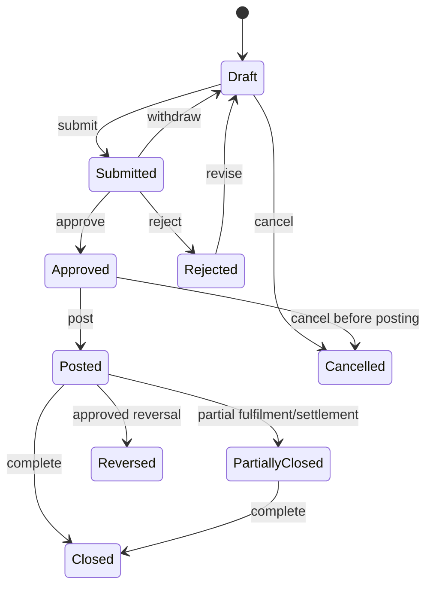

# 07 — Ortak İş Akışları ve Sistem Davranışları

## 1. Belge state machine



### Ortak geçiş kuralları

- Her transition command, expected version, actor, scope, reason ve correlation taşır.
- `submit` tam validation; draft kayıt esnek olabilir fakat geçersiz belge post edilemez.
- `approve` policy snapshot'ı ve görevler ayrılığı kontrol eder.
- `post` atomiktir; tekrar idempotent aynı sonucu verir.
- `reverse` yeni karşı belge/hareket üretir; asıl state ve içerik korunur.
- Transition geçmişi append-only tutulur.

## 2. Posting pipeline

1. Resource ve scope yüklenir, `FOR UPDATE`/version kontrol edilir.
2. Belge state, dönem, permission ve approval doğrulanır.
3. Master/reference snapshot ve vergi/kur kararı doğrulanır.
4. Modül kendi alt defter hareketini hazırlar.
5. `PostingRequest` muhasebe kuralı seçer ve satır taslağı üretir.
6. Borç=alacak, hesap aktifliği, şirket/dönem ve boyutlar doğrulanır.
7. Tek transaction içinde belge `posted`, alt defter hareketleri, journal ve outbox yazılır.
8. Commit sonrası notification/entegrasyon worker'a kalır.
9. Post-condition reconciliation metric/event üretilir.

Her hata transaction'ı tamamen geri alır; yarım stok/cari/GL olmaz.

## 3. Onay motoru

Policy girdileri:

- Belge türü ve eylem.
- Tenant/şirket/şube.
- Tutar, para ve fonksiyonel karşılık.
- Kategori, risk, iskonto, kredi limiti, tedarikçi değişikliği.
- Hazırlayanın rolü ve organizasyon ilişkisi.

Policy çıktısı sıralı/paralel aşamalar ve uygun approver grubudur. Başlatıldığı anda policy snapshot alınır; kural değişimi açık instance'ı sessizce değiştirmez.

## 4. Dönem kapanışı

```text
open → soft_close → review → hard_close
```

- `soft_close`: Normal kullanıcı backdate edemez; kapanış görevleri devam eder.
- `review`: Belge tamlığı, banka/cari/çek/stock/GL mutabakatı ve vergi çalışması.
- `hard_close`: Posting tamamen blok; yalnız çift onaylı reopen.
- Reopen belirli company + period + modül kapsamlı, süreli ve gerekçeli.
- Yeniden kapanışta ilk ve son mizan farkı raporlanır.

## 5. Import pipeline

1. Upload quarantine ve hash/dedup.
2. Parser yalnız veri okur; macro/formula çalıştırmaz.
3. `staging` kayıtları, satır numarası ve raw-safe representation.
4. Format/required/type/reference/scope validation.
5. Kullanıcı preview: eklenecek, güncellenecek, reddedilecek.
6. Onaylı batch; küçük transaction chunk'ları ve idempotent resume.
7. Sonuç sayımları, hata dosyası ve audit.
8. Finansal import sonrası mutabakat; posted kayıt doğrudan import edilemez, kontrollü opening/migration command kullanılır.

CSV export'ta `=`, `+`, `-`, `@` ile başlayan hücreler formula injection'a karşı güvenli yazılır.

## 6. Asenkron job

Durumlar: `queued → running → succeeded | failed_retryable | failed_final | cancelled`.

- Lease/heartbeat; worker ölürse süre sonrası yeniden sahiplenme.
- Attempt ve next_attempt_at; exponential backoff + jitter.
- İş idempotent veya checkpoint'li olmalıdır.
- Sonsuz retry yok; final hata insan kuyruğu.
- Job payload PII minimize; büyük payload blob reference.
- Deployment sırasında eski/yeni worker event version uyumlu.

## 7. Outbox/inbox

- Outbox iş transaction'ında yazılır.
- Worker `SKIP LOCKED` ile batch alır; publish/send ardından processed işaretler.
- Exactly-once iddiası yok; at-least-once + idempotent consumer.
- Inbox `provider/event_id` unique; response/result saklanır.
- Poison message payload gizli tutulur; redacted diagnostic ve secure attachment.

## 8. Hata ve telafi

| Hata | Davranış |
|---|---|
| Validation/business rule | Retry yok; kullanıcı düzeltir |
| Concurrency | Güncel sürüm göster; kullanıcı tekrar karar verir |
| Geçici dış servis | Otomatik backoff/retry |
| Kalıcı dış doğrulama | İnsan kuyruğu, payload/kural özeti |
| Transaction deadlock | Sınırlı server retry; idempotency korunur |
| Kısmi dış başarı | Reconciliation ve provider-specific compensation |
| Finansal yanlışlık | Orijinal korunur; onaylı reversal/correction |

## 9. Bildirim

- Domain olayından notification intent çıkar.
- Kullanıcının tercihleri, sessiz saatler ve kanal uygunluğu uygulanır.
- Bildirim finansal işlemin başarısını belirlemez.
- E-posta/SMS içine gereksiz finansal/kişisel veri koyulmaz; güvenli uygulama linki.
- Kritik security/approval olayı için delivery sonucu izlenir.

## 10. Zamanlanmış işler

- Kur importu, vade/çek uyarısı, reconciliation, backup check, retention ve rapor refresh.
- Her schedule tenant/company timezone ve iş takvimini açık taşır.
- Aynı job paralel koşamaz veya idempotent partition key kullanır.
- Missed run politikası (skip/run once/catch-up) job bazında.
- Manual run permission ve audit.

## 11. Ortak kabul senaryoları

- Aynı belge post isteği ağ timeout sonrası tekrarlandığında tek belge/fiş.
- Onay policy değişirken açık görev eski snapshot ile tamamlanıyor.
- Dönem kapanırken eşzamanlı posting ya önce tamamlanıyor ya bloklanıyor; arada kalmıyor.
- Worker commit sonrası ölürse outbox yeniden işleniyor fakat dış tarafta duplicate iş oluşmuyor.
- Tenant A import dosyasındaki Tenant B ID'si reddediliyor.
- Posted kayıt reversal sonrası asıl ve karşı hareket birlikte izleniyor.

## 12. Uçtan uca süreç döngüleri

### Order-to-cash

Teklif → sipariş taahhüdü → kredi/stok kontrolü → rezervasyon → kısmi sevk/teslim → fatura → vade kalemleri → ödeme → allocation → banka mutabakatı → cari/GL kontrol hesabı.

Sipariş ekonomik olay değildir; sevk stok olayını, fatura alacak/vergi olayını, ödeme nakit olayını yaratır. Politika sevk ile fatura zamanını bağlayabilir fakat kayıtlar birleşmez.

### Procure-to-pay

Talep → onay → tedarikçi teklifleri → sipariş taahhüdü → kabul/kalite → tedarikçi faturası → 2/3/4 yönlü eşleştirme → ödeme önerisi/onay → payment → allocation → banka mutabakatı.

Teslim alındı–faturalanmadı ve faturalandı–teslim alınmadı durumları exception değil, cut-off raporuna giren açık süreç durumlarıdır.

### Record-to-report

Kaynak olay posting’i → özel günlük/alt defter → control-account mutabakatı → banka/çek/stok/cari kontrolleri → tahakkuk/değerleme → vergi çalışma dosyası → trial balance → mali tablo → kilit.

### Count-to-adjust

Sayım planı → snapshot/watermark → kör sayım → tolerans → farklı kullanıcı tekrar sayımı → eşzamanlı hareket çözümü → onaylı adjustment → stok/GL mutabakatı.

### Bank-statement-to-reconciliation

Dosya/API kabulü → raw hash ve kontrol toplamı → normalize statement line → duplicate kontrol → öneri/skor → insan kararı → approved reconciliation → fark/masraf/kur olayı → kapanış bakiyesi mutabakatı.

## 13. Posting exception ve repost

- Posting doğrulama hatası transaction’ı geri alır; belge AccountingStatus=exception veya approved/pending olarak kalır, asla sahte posted olmaz.
- Exception kaydı source, rule version, dönem, gizlenmiş hata, owner, ilk/son görülme ve çözüm komutlarını taşır.
- “Retry” aynı idempotency/source key ile çalışır; yeni belge/fiş/numara üretmez.
- Kaynak iş hatalıysa correction/reversal; yalnız türetilmiş projection hatalıysa onaylı repost kullanılır.
- Repost dry-run, etkilenen belge/fiş/rapor sayısı, kapalı dönem ve dış beyan etkisini gösterir.

## 14. Kilit kapsamları ve kapanış

Tek dönem durumu yerine kontrollü kapsam kullanılır:

- operational lock: kaynak modül backdate/fulfilment;
- inventory valuation lock: maliyet zinciri;
- GL lock: journal posting;
- tax lock: beyan kesimi;
- hard/legal lock: tüm mali etkiler.

Bir kapsamın açılması diğerlerini otomatik açmaz. Reopen süreli, company/period/module scoped, farklı onaylayanlı ve ilk/son mizan fark raporludur.

## 15. Outbox sırası

At-least-once teslimatta consumer idempotent olmalıdır. Aynı aggregate için aggregateId + sequenceNumber sırası korunur; sonraki mesaj önceki kalıcı hatadayken sessizce geçemez veya sağlayıcı sözleşmesine göre açıkça bağımsız olarak işaretlenir. Outbox iş transaction’ı rollback olursa mesaj yayınlanmaz; worker commit sonrası ölürse tekrar teslim normal ve ölçülen davranıştır.

## 16. Ek kabul senaryoları

- Tek ödeme üç takside dağıtılıyor; bir allocation karşı olayla kaldırılıyor, payment ve GL değişmiyor.
- Ödeme kaydedilmiş fakat ekstre gelmemişken belge “in transit”; statement onayıyla reconciled oluyor.
- Bir sipariş satırı iki sevke, tek fatura satırı her iki sevke miktar bazında bağlanıyor; kalan sıfır.
- Geçmiş tarihli stok girişi sonraki değerleme katmanlarını etkiliyor; impact preview ve onaylı repost sonrası stok/GL sıfır fark.
- Posting exception düzeltilip retry edildiğinde tek aktif fiş, tek dış olay ve eksiksiz audit oluşuyor.
- Tax lock kapalı olmayan operasyonel dönemde geç gelen belge için policy açık correction period üretiyor; sessiz backdate yok.
