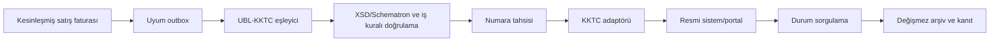

# KKTC Elektronik Fatura Modülü

## 1. Amaç ve yasal konum

Bu modül ticari faturanın kendisinden ayrı bir uyum ve iletim katmanıdır. Satış faturası satış modülünde oluşur; burada resmi şemaya dönüştürme, doğrulama, numaralama, gönderim, durum takibi, iptal ve yasal arşiv yönetilir.

Araştırma kesim tarihi: **19 Ağustos 2026**. Uygulama başlamadan ve her canlı sürüm öncesinde resmi kurallar yeniden doğrulanmalıdır. Birleştirilmiş 26 Haziran 2026 kuralları şu tasarım girdilerini doğurur:

- 2025 hesap dönemi satış veya gayrisafi iş hasılatı **2.000.000.000 TL ve üzeri** olan mükellefler için 1 Ocak 2027 başlangıçlı zorunluluk öngörülmektedir.
- Düzenlenen elektronik faturada sonradan değişiklik yapılamaz; düzeltme/iptal resmi süreçle yapılmalıdır.
- Doğrudan entegrasyon başvuru, test ve Gelir ve Vergi Dairesi onayı gerektirir.
- Yurt dışından yönetilen bilgi işlem sistemi için Daire onayı gerekliliği dikkate alınmalıdır.
- Fatura numarası; 9 karakter VKN + 4 karakter yıl + en çok 9 karakter şube + 11 karakter sıra bileşiminden oluşur; yinelenen numara reddedilir.
- Veri kaybı veya bozulması olayının üç iş günü içinde Daireye bildirilmesi ve işlemlerin nasıl tamamlanacağına ilişkin plan sunulması gerekebilir.
- İptal resmi uygulama üzerinden ve ilgili KDV beyan süresi içinde yürütülür; her iki taraf kullanıcıysa alıcı onayı gerekebilir.
- Arşiv; bütünlük, okunabilirlik, veri tabanı/depolama ve görüntüleme imkânlarını korumalıdır.

Hukuki kaynaklar [kaynaklar](../references/SOURCES.md) ve [hukuki matris](../legal/01-kktc-legal-matrix.md) dosyalarındadır.

## 2. Mimari sınır

Portal üzerinden manuel işlem ilk güvenli seçenek olabilir. Doğrudan entegrasyon adaptörü, resmi test/onay tamamlanmadan üretimde etkinleştirilmez.

## 3. Ana varlıklar

- `einvoice_profile`, `einvoice_branch`
- `einvoice_submission`
- `einvoice_payload_version`
- `einvoice_number_allocation`
- `einvoice_validation_result`
- `einvoice_transport_attempt`
- `einvoice_status_event`
- `einvoice_cancellation_request`
- `einvoice_archive_item`
- `einvoice_incident`

Ticari fatura kimliği ile resmi elektronik fatura kimliği ayrı tutulur. Bir ticari faturanın yeniden gönderimleri aynı `submission` altında deneme olarak saklanır; yeni resmi belge olduğu izlenimi doğurmaz.

## 4. Durum makinesi

`not_required → prepared → validated → numbered → queued → submitted → accepted`

İstisnalar: `validation_failed`, `submission_failed`, `rejected`, `cancellation_requested`, `cancelled`, `archived`.

- İş/şema hatası otomatik yeniden denenmez; kullanıcı düzeltmesi gerekir.
- Ağ/5xx gibi geçici hata üstel gecikmeyle tekrar denenebilir.
- Sonuç bilinmiyorsa yeni gönderim yapılmadan resmi durum sorgulanır.
- Kabul edilmiş belge yeniden oluşturulmaz veya yerinde değiştirilmez.

## 5. Numara tahsisi

- Sunucu tarafında, şirket + mali yıl + şube kapsamında seri kilidi veya PostgreSQL sequence benzeri atomik mekanizma kullanılır.
- Resmi bileşim/uzunluk kuralları yapılandırılır ve hem tahsis hem gönderim öncesi doğrulanır.
- Ayrılan numara başka belgeye devredilmez. Boşluk oluşursa nedeni ve yasal işlem kararı kaydedilir.
- Uygulama ve adaptör benzersiz kısıtları, paralel isteklerde yinelenmeyi önler.
- Mobil istemci çevrim dışıyken resmi fatura numarası ayıramaz.

## 6. Belge üretme ve doğrulama

1. Fatura, cari ve vergi anlık görüntüleri alınır.
2. Sürümü sabitlenmiş UBL-KKTC eşleyici XML üretir.
3. XML güvenli ayrıştırıcıyla XSD, Schematron ve yerel iş kurallarından geçer.
4. Vergi/toplamlar kaynak faturayla kuruş seviyesinde mutabık olmalıdır.
5. Kanonik içerik hash'i, şema sürümü ve uygulama sürümü kaydedilir.
6. Başarılı doğrulamadan sonra numara ayrılır ve yük imza/iletim katmanına gönderilir.

XXE/dış varlık çözümleme kapalıdır; dosya boyutu ve işlem süresi sınırlandırılır. Resmi örnek/kılavuzlar sürüm kontrollü test fixture'larına dönüştürülür.

## 7. İletim adaptörü

Adaptör aşağıdaki arabirimi uygular:

- `validateCapabilities()`
- `submit(document, idempotencyKey)`
- `queryStatus(externalId)`
- `requestCancellation(reason, evidence)`
- `downloadOfficialCopy(externalId)`

Kimlik bilgileri secret store'da tutulur; yük ve kişisel veriler uygulama loguna yazılmaz. TLS doğrulaması gevşetilemez. Resmi ortamların test/üretim adresleri yapılandırma ve izin açısından ayrıdır.

## 8. İptal ve düzeltme

- Kullanıcı kaynak ticari belgeyi seçer; sistem resmi durum ve KDV dönemi uygunluğunu kontrol eder.
- Gerekçe, kanıt, talep eden/onaylayan ve zaman damgası saklanır.
- Alıcı onayı gereken senaryo ayrı bekleme durumunda gösterilir.
- Resmi iptal sonucu, satış/cari/stok/muhasebe modüllerine ters işlem komutunu tetikler; kaynak kayıt silinmez.
- Süre dışı veya reddedilmiş iptal için mali müşavir yönlendirmesi ve kontrollü düzeltme iş akışı gerekir.

## 9. Arşiv ve olay yönetimi

Arşiv paketi: gönderilen tam yük, görüntülenebilir kopya, doğrulama raporu, resmi yanıtlar, durum olayları, iptal kanıtları, içerik hash'leri, şema/uygulama sürümü ve kaynak belge bağlantısı.

- WORM/nesne kilidi destekli dış kopya hedeflenir.
- Düzenli hash doğrulaması ve örnek belge açma testi yapılır.
- Saklama süresi hukuki matriste onaylanır; kullanıcı silme işlemi uygulanmaz.
- Veri kaybı/bozulması için olay kaydı üç iş günlük hukuki bildirim saatini görünür biçimde başlatır; kurum bildirimi otomatik yapılmaz, yetkili kişi onayı ister.

## 10. API ve ekranlar

- `POST /api/v1/einvoices/{salesInvoiceId}/prepare`
- `POST /api/v1/einvoices/{id}/submit`
- `POST /api/v1/einvoices/{id}/refresh-status`
- `POST /api/v1/einvoices/{id}/cancellation-requests`
- `GET /api/v1/einvoices/{id}/archive`

Ekranlar: e-fatura çalışma kuyruğu, doğrulama hata ayrıntısı, gönderim zaman çizelgesi, iptal masası, arşiv görüntüleyici, olay/bildirim sayacı ve entegrasyon sağlık panosu.

## 11. Değişmez kurallar ve testler

- `EFI-INV-001`: Aynı resmi numara ikinci belgeye bağlanamaz.
- `EFI-INV-002`: Kabul edilen yük/hash değişemez.
- `EFI-INV-003`: Bir ticari belge için yalnızca bir etkin resmi belge bulunur; iptal/değiştirme bağlantısı açıkça tutulur.
- `EFI-INV-004`: Gönderim, şema ve toplam mutabakatı geçmeden başlayamaz.
- `EFI-INV-005`: Belirsiz sonuçta sorgulama yapılmadan yeniden gönderim yoktur.
- `EFI-INV-006`: Resmi durumu değişen her işlem audit ve outbox olayı üretir.

Testler: resmi olumlu/olumsuz örnekler, sayı yarış koşulu, zaman aşımı sonrası durum sorgusu, yinelenen webhook/yanıt, KDV/toplam yuvarlama, iptal süreleri, arşiv hash/restore testi, yetki/şirket izolasyonu ve resmi test ortamı uçtan uca senaryosu.

## 12. Üretim onay kapısı

Doğrudan entegrasyon; Daire başvurusu, teknik test sonucu, veri konumu/yurt dışı yönetim onayı, şema sürümü, sertifika ve destek sorumluları belgelenmeden kapalı kalır. Portal modu kullanılacaksa kullanıcı adımları, çift kontrol ve resmi makbuz yükleme zorunludur.

## 13. UBL belge zinciri ve profil yönetimi

OASIS UBL genel referans modeldir; üretimde yalnız KKTC Gelir ve Vergi Dairesinin onaylı profil, XSD, Schematron, kod listesi ve ek iş kuralları bağlayıcıdır. Genel UBL’de bir alan bulunması KKTC profilinde serbest olduğu anlamına gelmez.

InvoiceLine, ilgili OrderLine, DespatchLine ve ReceiptLine referanslarını çoktan çoğa SourceLineLink üzerinden korur. Prepayment, pro-forma, normal invoice, credit/debit note ve cancellation aynı belge tipi gibi ele alınmaz. Charge/allowance, tax order ve document reference’lar source snapshot’tan deterministik üretilir.

EInvoiceProfileVersion:

- official source URL/file hash ve retrieval/approval date;
- XSD/Schematron/code-list hash;
- valid-from/to ve accepted namespaces;
- sample/conformance test seti;
- certificate/signature policy;
- migration/coexistence ve rollback planı

taşır. Eski zarf, yeni profil ile yeniden serialize edilmez.

## 14. Ticari, mali ve iletim durumu ayrımı

Faturanın BusinessStatus, AccountingStatus ve EInvoiceTransmissionStatus alanları ayrıdır. Dış ret:

- kaynak ticari olayın ve yerel GL’nin otomatik silinmesi değildir;
- ret nedeni sınıfına göre resend, replacement, cancellation veya manual review komutu üretir;
- aynı resmi numara/payload için provider idempotency ve status query uygular;
- kabul/ret yanıtının raw hash’i, alınma zamanı ve correlation’ını saklar.

Outbox retry yalnız iletimi tekrarlar; yeni fatura, numara, GL veya cari açık kalem üretmez. Portal modunda indirilen resmi makbuz/yanıt, zarf ve kullanıcı eylemi aynı kanıt paketine bağlanır.

## 15. Ek conformance ve audit testleri

- Sipariş satırının iki sevke bölünüp tek invoice line’a bağlanması.
- Credit note’un orijinal invoice, tax decision, allocation ve GL reversal bağlantısı.
- Aynı zarfın timeout sonrası yeniden gönderiminde tek resmi sonuç.
- Profil geçiş gününde eski/yeni namespace ve tarih etkili validation.
- XML canonical bytes/hash, arşiv restore’u ve yeniden doğrulama.
- Ticari posted fakat e-Fatura rejected ekran/raporunun yanlış “başarılı” göstermemesi.
