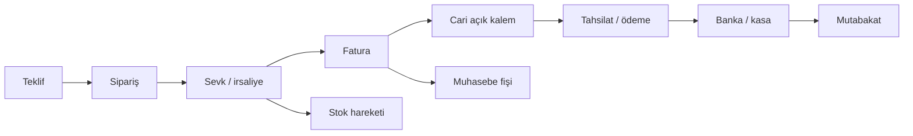

# Logo ERP ve Benzer Ürünler — Tasarım Benchmark'ı

## 1. Amaç ve clean-room sınırı

Bu belge Logo ERP'nin ve benzer ürünlerin kamuya açık işlevlerini, yeni KKTC ERP için tasarım girdisine dönüştürür. Amaç Logo'nun kodunu, veri tabanı şemasını, özel ekranını, metnini veya markasını kopyalamak değildir. Yeni sistem özgün domain modeli, API ve UI ile clean-room geliştirilecektir.

Araştırma kesim tarihi: **19 Ağustos 2026**. Ürün/paket/fiyat bilgileri değişebilir; satın alma kararı öncesi üretici teklifi ve PoC gerekir.

## 2. Logo ürün ailesi nasıl okunmalı?

Logo tek bir program değil; şirket ölçeği, kurulum modeli ve süreç derinliğine göre ayrışan bir ürün ailesidir:

| Ürün çizgisi | Genel konum | Güçlü referans | Bu proje için çıkarım |
|---|---|---|---|
| Logo Bulut ERP | Tarayıcıdan paketli ERP; KOBİ/orta ölçek | Finans, muhasebe, satış, satın alma, stok, cari, banka/kasa, çek/senet ve eklentiler | İstenen kapsam basit ön muhasebeden geniş; bütünleşik Standard-benzeri çekirdek gerekir |
| Tiger Wings Enterprise | Web/on-premise, daha büyük ve karmaşık işletme | Üretim/MRP, kalite, dış ticaret, finans, varlık ve iş akışı derinliği | İlk sürümde kapsam şişirilmemeli; modül ve onay disiplini alınmalı |
| Netsis ERP ailesi | Orta/büyük işletme ve üretim odağı | Modüler süreç, üretim/tedarik ve özelleştirme | Gelecekte üretim eklenirse ayrı bounded context gerekir |
| Logo ERP Mobil | Seçilmiş saha/yönetici işleri | Cari/stok görüntüleme, onay, dashboard, sipariş/fatura | Mobil, masaüstünün kopyası değil; dar görev istemcisi olmalı |

Bu yorum Logo'nun resmi ürün sayfalarındaki işlev gruplarından türetilmiştir; kaynaklar [kaynakça](SOURCES.md) içindedir.

## 3. Logo'nun esas gücü: belge zinciri

Logo benzeri olgun ERP'lerde değer, ekran sayısından çok aynı ticari olayın farklı alt defterlerde tutarlı yaşamasıdır:

Yeni sistemde her ok kaynak ve hedef kimliğini, kalan miktarı/tutarı, kullanıcı/zamanı ve ters işlem bağını korumalıdır. “Fatura ekranına cari ve stok update'i koymak” bu bütünlüğün yerine geçmez; domain komutları ve aynı transaction/outbox sınırı gerekir.

## 4. İşlevsel benchmark

| Alan | Olgun ERP davranışı | Yeni sistem şartı | İlgili belge |
|---|---|---|---|
| Firma/dönem | şirket, mali dönem, şube, ambar ve seri ayarları | company/branch/fiscal scope, tarih etkili ayarlar | [Organizasyon](../modules/02-organization-master-data.md) |
| Ana veri | malzeme, hizmet, birim, cari, banka, kasa, hesap | tekil iş anahtarı, sürüm/audit, import kalitesi | [Cari](../modules/03-party-current-accounts.md), [Stok](../modules/04-items-inventory.md) |
| Satış | teklif→sipariş→sevk→fatura→iade→tahsil | kısmi dönüşüm, kalan, fiyat/iskonto/risk, ters belge | [Satış](../modules/05-sales.md) |
| Satın alma | talep→onay→teklif→sipariş→kabul→fatura→ödeme | üç yönlü eşleştirme, tolerans, görev ayrılığı | [Satın alma](../modules/06-purchasing.md) |
| Stok | giriş/çıkış/transfer/sayım, seri/lot ve maliyet | fiziksel/rezerve/kullanılabilir/yoldaki ayrımı; append-only hareket | [Stok](../modules/04-items-inventory.md) |
| Cari | borç/alacak, vade, risk, kapama, yaşlandırma, kur farkı | açık kalem ve allocation; GL kontrol hesabı mutabakatı | [Cari](../modules/03-party-current-accounts.md) |
| Banka/kasa | havale/virman/dekont, ekstre ve mutabakat | import tekilleştirme, match skoru, maker-checker | [Banka/kasa](../modules/07-banking-cash.md) |
| Çek/senet | portföy, ciro, tahsil/ödeme, karşılıksız | araç olay zinciri, fiziki custody ve risk | [Çek/senet](../modules/08-cheques-promissory-notes.md) |
| Muhasebe | otomatik fiş, hesap planı, dönem sonu | sürümlü posting rule; çift kayıt; alt defter mutabakatı | [Muhasebe](../modules/09-accounting-general-ledger.md) |
| Onay | bildirim, rol, limit, görev | policy version, SoD, delegation ve SLA | [İş akışı](../modules/12-workflow-approvals.md) |
| Rapor/mobil | bakiye, stok, dashboard, seçilmiş işlemler | role göre drill-down; API-first dar mobil kapsam | [Rapor](../modules/14-reporting-dashboard.md), [Android](../clients/02-android-application.md) |

## 5. Günlük kullanım modeli

### 5.1 İlk kurulum

1. Tüzel şirket, mali yıl, şube, depo, iş takvimi ve belge serileri.
2. KKTC Tekdüzen Hesap Planı; yardımcı hesap, masraf merkezi ve kayıt şablonları.
3. Kullanıcı/rol/scope; onay limitleri ve görevler ayrılığı.
4. Para birimi, kur, KDV/vergi, vade ve yuvarlama politikaları.
5. Cari, ürün/hizmet, birim, barkod, banka, kasa ve çek ana verileri.
6. Açılış stok/cari/banka/kasa/çek ve onaylı açılış fişi.
7. Satış/satın alma/banka olaylarının stok–cari–GL sonuçlarıyla golden test.

### 5.2 Günlük iş

- Satış: sipariş, stok ayırma, kısmi sevk/fatura, tahsilat.
- Satın alma: talep/onay, sipariş, kabul, fatura farkı ve ödeme.
- Depo: giriş/çıkış/transfer/lot/seri/sayım; geçmiş tarih ve negatif stok kontrolü.
- Finans: ekstre, eşleştirme, ödeme/tahsilat, nakit pozisyonu.
- Çek: portföy, ciro/banka/teminat, sonuç ve risk.
- Muhasebe: istisna kuyruğu, otomatik fiş ve mutabakat.

### 5.3 Ay sonu

1. Eksik/askıda belgeler ve outbox/entegrasyon istisnaları.
2. Stok maliyeti ve envanter mutabakatı.
3. Cari yaşlandırma, banka/kasa ve çek portföy mutabakatı.
4. Kur değerleme, tahakkuk/dağıtım ve KDV çalışma dosyası.
5. Alt defter–büyük defter sıfır fark kontrolü.
6. Mizan/rapor, kontrol listesi, dönem kilidi.

Bu akış, web ana navigasyonunu değil iş teslim sırasını belirler.

## 6. Logo'dan alınacak desenler

- Kaynak belge ve dönüşüm zinciri.
- Tek ana veriyle satış/satın alma/stok/cari/finans entegrasyonu.
- Otomatik fakat açıklanabilir muhasebeleştirme.
- Çoklu para birimi, vade, risk, seri/lot ve depo boyutları.
- Belge numarası, dönem, yetki ve onay disiplini.
- Dönem sonu mutabakatı ve kaynak belgeye drill-down.
- Mobilde göreve özgü özet ve onay.

## 7. İyileştirilecek desenler

- Daha az menü/sekme, role göre çalışma masaları ve güçlü global arama.
- Teknik hata yerine iş anlamlı neden/çözüm ve korelasyon kodu.
- API-first; web/mobil/entegrasyon aynı contract üzerinden.
- Kesinleşmiş mali sonuçta append-only olay/ters kayıt.
- Vergi ve posting kurallarında yürürlük tarihli sürüm/anlık görüntü.
- Gerçek zamanlı audit/outbox/entegrasyon sağlık görünümü.
- Erişilebilir, klavye verimli, shadcn sadeliğinde özgün UI.

## 8. Alınmayacak desenler ve KKTC farkı

- Türkiye GİB, e-Arşiv, e-İrsaliye veya özel entegratör varsayımlarını KKTC'ye taşımak.
- Türkiye hesap/vergi/beyan kodunu KKTC Tekdüzen yerine kullanmak.
- İstemci/entegrasyona doğrudan DB erişimi vermek.
- Vergi oranını farklı modüllere sabit dağıtmak.
- Kesinleşmiş belgeyi yetkili admin ekranından yerinde değiştirmek.
- Çok sayıda modal/sekme ve kodlara hâkim olmayı kullanıcı deneyimi saymak.
- Üretim/MRP/İK/CRM gibi ilk değer dilimine girmeyen modülleri sırf rakipte var diye yapmak.

Logo'nun Türkiye e-dönüşüm bileşenleri yerine [KKTC e-fatura](../modules/11-kktc-e-invoice.md) ve [vergi](../modules/10-kktc-tax-compliance.md) adaptörleri uygulanır.

## 9. Açık kaynak ERP ve muhasebe sistemlerinden doğrulanan dersler

| Sistem | İncelenen davranış | Bu projeye alınan karar |
|---|---|---|
| ERPNext | Değişmez GL/stok hareketi, payment ledger, reconciliation ve kontrollü repost | Kaynak belge, stok alt defteri, cari/ödeme tahsisi ve GL ayrı fakat uzlaşan katmanlar; repost yalnız türetilmiş görünümü yeniden kurar |
| Odoo | Ödeme kaydı ile banka settlement’ı ayrımı; taksit başına açık kalem; sürekli/dönemsel stok; ayrı kilit tarihleri | “Ödendi” tek boolean olmayacak; payment, allocation ve bank reconciliation durumları ayrı; taksit/vade kalemleri ve GL/vergi/operasyon kilit kapsamları açık |
| Tryton | Model/kayıt/alan/buton yetkisi, farklı kullanıcı sayısı isteyen onay ve sevk/fatura istisnaları | Onay quorum’u farklı kişi şartı taşıyabilir; “başarısız” yerine iş anlamlı exception state ve çözüm komutu |
| Apache OFBiz | Party-role, payment application, facility/location/owner ve ayrı order adjustment modelleri | Aynı party birden çok rolde; ödeme–fatura tahsisi ayrı varlık; stokta sahiplik ile fiziksel konum ayrılabilir; vergi/iskonto/navlun satır etkileri izli |
| iDempiere | Accounting schema, posting processor, Fact_Acct ve muhasebe boyutları | Posting rule sürümü ve satır boyutları belgeye snapshot edilir; posting exception ayrı operasyon kuyruğudur |
| LedgerSMB | PostgreSQL tabanlı çift kayıt, rapor şablonları ve submit/approve/reject mutabakat seti | Banka mutabakatı taslak–gönderilmiş–onaylı yaşam döngüsü ve maker-checker kontrolü taşır |
| GnuCash | Transaction/split ve invoice/payment ilişkisi için lots | Dengeli transaction ve invoice allocation birbirine karıştırılmaz; açık kalem hangi ödeme/krediyle kapandı sorusu doğrudan yanıtlanır |
| Dolibarr | Basit accounting ile double-entry accounting’in ayrı kapsamları | Ön muhasebe ekranları GL doğruluğunun yerine geçmez; GL devredeyse her kaynak olay için posting ve mutabakat zorunludur |
| Ledger CLI | Rapor/bakiye, kaynak çift kayıt hareketlerinden türetilir | Değişebilir “current balance” otorite değildir; performans snapshot’ı yeniden üretilebilir ve kaynağa mutabıktır |

### 9.1 Alınmayan veya sınırlandırılan desenler

- Başka ERP’nin tablo veya kodunu kopyalamak yerine davranış/invariant temiz odada yeniden modellenir.
- Odoo record-rule yaklaşımındaki varsayılan izin riski alınmaz; bu sistemde yetki varsayılan reddir.
- Kaynak iş olayı başarırken GL posting’in sessizce hata günlüğüne düşmesi kabul edilmez. Belgenin “iş durumu” ile “muhasebe durumu” ayrı görünür; tam muhasebeleşmiş gibi gösterilmez.
- ERPNext/Odoo’daki ülkeye veya ürüne özgü dönem/vergi davranışı KKTC kuralı sayılmaz; yerel mali müşavir ve resmi onay kapısından geçer.
- GnuCash gibi küçük işletme araçlarındaki posted kaydı geri açma yaklaşımı alınmaz; bu projede kesinleşmiş mali etki reversal/correction ile düzeltilir.

## 10. Literatür ve standartlarla boşluk analizi

| Araştırma bulgusu | Eski plandaki boşluk | v1.1 düzeltmesi | Kabul kanıtı |
|---|---|---|---|
| REA: taahhüt, ekonomik olay, kaynak ve aktör ayrı kavramlardır | Journal ve belge merkezli model güçlüydü; commitment/event dili dağınıktı | Sipariş taahhüt, sevk/teslim/ödeme ekonomik olay; party/warehouse/bank aktör veya kaynak olarak açık modellendi | Her süreç için REA tablosu ve source→subledger→GL izi |
| Alt defter toplamı GL kontrol hesabına eşit olmalıdır | Mutabakat vardı; özel günlük/control-account terminolojisi eksikti | Cari, stok, banka ve çek için kontrol hesabı ve sıfır fark kuralı kesinleştirildi | Otomatik cross-foot ve as-of reconciliation testi |
| Ödeme, faturaya tahsis ve bankada kesinleşme farklı olaylardır | Settlement tek kavram altında fazla yoğundu | Payment, allocation/unallocation ve bank statement reconciliation ayrıldı | Kısmi/taksitli/avans/fazla ödeme senaryosu |
| Etkin tarih ile sisteme kayıt/posting zamanı ayrıdır | legal_date ve created_at vardı; etkiler eksik tanımlıydı | effective_date, document_date, posted_at ve recorded_at semantiği; cut-off ve backdate politikası | Geç gelen fatura ve geçmiş tarihli stok golden testi |
| Değişmez defterlerde düzeltme ters kayıtla olur; türetilmiş defter kontrollü repost edilebilir | Reversal vardı; repost ile düzeltme sınırı yoktu | Business correction ile projection rebuild ayrıldı; lineage ve generation zorunlu | Önce/sonra toplam ve hash eşitliği |
| UBL satırları sipariş–sevk–teslim–fatura arasında bire bir olmak zorunda değildir | Kısmi dönüşüm vardı; çoktan çoğa satır bağlantısı net değildi | SourceLineLink ile miktar/tutar bazlı çoktan çoğa dönüşüm ve kalan hesabı | Bölünmüş sevk/birleşik fatura testi |
| COSO: kontrol yalnız onay değil; risk, bilgi ve sürekli izlemeyi kapsar | SoD ve audit güçlüydü; kontrol sahibi/frekansı/kanıtı dağınıktı | Kontrol kataloğu: risk, owner, önleyici/tespit edici tür, sıklık, kanıt ve exception | Kontrol yürütme ve erişim gözden geçirme raporu |
| ERP başarısı go-live’dan sonra kullanım/yarar aşamasında ölçülür | Teknik release kapıları baskındı | eğitim, süreç sahibi, pilot, paralel kapanış, benimseme/KPI ve hypercare eklendi | 30/60/90 günlük fayda ve hata gözden geçirmesi |

### 10.1 Kanonik süreç ve defter modeli

    Taahhüt (sipariş/sözleşme)
       → Ekonomik olay (sevk/kabul/fatura/ödeme)
          → Alt defter (stok/cari/banka/çek)
          → Posting engine + kural snapshot → değişmez GL
          → Allocation (ödeme ↔ açık kalem)
    Banka ekstresi değişmez ham satırı → mutabakat → ekonomik olay
    Alt defter toplamı ↔ GL kontrol hesabı

Kurallar:

1. Kaynak ekonomik olay gerçek otoritedir; türetilmiş ledger/projection kayıtları kaynak kimliği ve posting generation taşır.
2. Business correction yeni kaynak olay/reversal üretir. Repost yalnız bozulmuş veya kural değişimiyle yeniden kurulması onaylanmış türetilmiş projection’ı etkiler.
3. Payment nakit/banka hareketidir; allocation hangi açık kalemi kapattığını, reconciliation bankanın bunu hangi statement satırında kesinleştirdiğini söyler.
4. Rapor her satırdan kaynak belgeye, alt deftere ve GL fişine drill-down sunar; export aynı as-of kesim ve filtre manifestini taşır.

## 11. Build mi uyarlama mı? Karar PoC'si

Kullanıcının ürün geliştirme hedefi nedeniyle ana karar özel modüler çekirdektir. Yine de maliyet/risk doğrulaması için ERPNext veya başka açık çekirdekle en fazla 2 haftalık, kodu üretim tabanına karıştırmayan PoC yapılabilir:

1. Çok dövizli satış siparişi → kısmi sevk → fatura → cari → dengeli fiş.
2. Satın alma → kısmi kabul → fatura farkı → banka ödemesi → mutabakat.
3. Müşteri çeki → portföy → ciro/tahsil/karşılıksız → risk ve GL.
4. Şirket/şube/depo scope, maliyet gizleme ve Android-benzeri API istemcisi.
5. KKTC vergi/e-fatura adaptörünün çekirdekten ayrılabilmesi.

Değerlendirme:

- fonksiyon kapsamı ≥ %80,
- finansal/tenant/güvenlik kontrolleri = %100,
- KKTC adaptörü ayrılabilirliği = %100,
- upgrade/backup/API ve lisans toplam maliyeti kabul edilebilir.

PoC sonucu ADR ile kaydedilir. Yüzde eşiği karşılanmıyorsa PoC kodu ana ürüne parça parça kopyalanmaz.

## 12. Logo'dan veri taşıma keşfi

Logo sürümü ve erişim biçimi görülmeden tablo/kolon adı varsayılmaz. Taşıma ekibi:

- resmi/izinli export veya kullanıcı raporu/API/SQL erişim sözleşmesini,
- firma/dönem/işyeri/ambar kodlarını,
- cari ve malzeme alternatif kod/birim/barkodlarını,
- belge tip/durum/iptal/iade bağlarını,
- açık kalem ve ödeme kapamalarını,
- stok miktar ile maliyet yöntemini,
- çek/senet bordro ve durum tarihçesini,
- hesap planı, fiş ve kaynak belge referansını,
- Türkiye e-belge alanlarının KKTC'de taşınıp taşınmayacağını

profil çıkararak belirler.

Kaynak DB şemasına sıkı bağlı production entegrasyonu yapılmaz. Veri önce hash'li staging'e alınır, mapping sürümlenir ve [migration planındaki](../quality/04-data-migration-and-quality.md) mutabakat kapıları uygulanır.

## 13. Son karar

Bu proje Logo'nun “tek ticari olay, bağlantılı alt defterler ve muhasebe” disiplinini; REA ile açıklanan kaynak olayları, ayrı allocation/settlement kayıtları, modern API, sade UI, değişmez mali kayıt ve güçlü restore yaklaşımıyla yeniden kuracaktır. Türkiye mevzuatına bağlı katmanlar alınmayacak; KKTC uyumu ayrı, sürümlü ve resmi onay kapılı olacaktır. Ayrıntılı araştırma kaynakları [kaynakçada](SOURCES.md), uygulanan teknik kurallar ilgili modül belgelerindedir.
